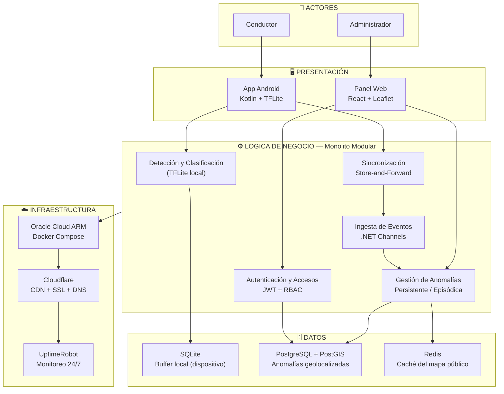

# Arquitectura Inicial del Sistema

ViaLibre nace como un **monolito modular**. Todo el backend corre en un solo proceso, pero organizado en bounded contexts internos con responsabilidades separadas. Cada módulo puede extraerse como servicio independiente conforme el sistema crezca, sin reescribir la lógica de negocio.

## Diagrama de arquitectura

## Descripción de capas

**Presentación:** la app Android es el punto de entrada del conductor-detecta anomalías en segundo plano sin que el conductor toque la pantalla. El panel web es la interfaz del administrador para monitorear el sistema, gestionar usuarios y exportar datos.

**Lógica de negocio:** cinco módulos con responsabilidades separadas dentro de un solo proceso. Detección y Clasificación corren localmente en el dispositivo con TFLite. Sincronización implementa el patrón Store-and-Forward con backoff exponencial. Ingesta de Eventos usa .NET Channels para absorber hasta 300 dispositivos sincronizando simultáneamente. Gestión de Anomalías aplica las reglas de validación y distingue anomalías persistentes de episódicas. Autenticación y Accesos controla el ingreso al panel con JWT y tres niveles de rol.

**Datos:** SQLite actúa como buffer local en el dispositivo del conductor durante los tramos sin señal. PostgreSQL con PostGIS almacena todas las anomalías geolocalizadas. Redis gestiona la caché del mapa público para responder en menos de 250 ms.

**Infraestructura:** todo corre sobre Oracle Cloud ARM con Docker Compose, con costo operativo mínimo. Cloudflare gestiona el CDN, SSL y DNS. UptimeRobot monitorea los cuatro subdominios cada 5 minutos.