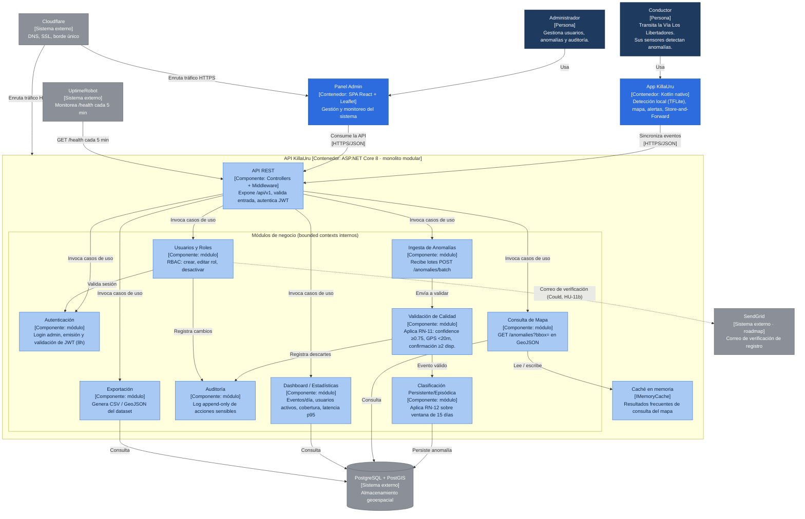

# Diagrama de componentes — KillaUru API Backend

Modelo C4 · Nivel 3 (componentes) · Estilo: monolito modular en capas

Este diagrama detalla los componentes internos del backend de KillaUru (`API-KillaUru`, ASP.NET Core 8). A diferencia de una arquitectura de microservicios, todos los módulos corren en un único proceso desplegado con `docker compose up -d` — decisión forzada por DA-06 (una sola persona desarrolla y opera el sistema) — pero se mantienen separados internamente como *bounded contexts* para poder escalar o extraerse en el futuro (DA-09). No hay pasarela de pagos, ERP ni servicio de envíos como en un marketplace: los sistemas externos de KillaUru son de infraestructura (base de datos, borde de red, monitoreo) y, a futuro, de notificación por correo.

## Diagrama (Mermaid)

## Detalle de componentes

| Componente | Tipo | Responsabilidad | Requisitos / épica relacionados |
|---|---|---|---|
| API REST | Componente (Controllers + Middleware) | Punto de entrada único; expone `/api/v1`, valida el esquema de entrada y autentica cada petición mediante JWT. | RF-11, RF-16 |
| Autenticación | Módulo (bounded context) | Verifica credenciales del administrador, emite y valida JWT con expiración de 8 h, bloquea tras 3 intentos fallidos. | RF-16, HU-11, EP-05 |
| Ingesta de Anomalías | Módulo (bounded context) | Recibe lotes de hasta 50 eventos desde la app vía `POST /api/v1/anomalies/batch`. | RF-11, HU-04, EP-03 |
| Validación de Calidad | Módulo (bounded context) | Aplica RN-11: descarta eventos con confidence < 0.75, GPS con precisión > 20 m o timestamp fuera de rango; exige confirmación de ≥ 2 dispositivos en 100 m / 72 h para severidad alta. | RF-12, HU-05, EP-03 |
| Clasificación Persistente/Episódica | Módulo (bounded context) | Aplica RN-12: marca una anomalía como PERSISTENTE si aparece en ≥ 3 días distintos dentro de 15 días; en caso contrario, EPISÓDICA. | RF-13, HU-06, EP-03 |
| Consulta de Mapa | Módulo (bounded context) | Expone `GET /api/v1/anomalies?bbox=` devolviendo anomalías en GeoJSON, con soporte de delta sync. | RF-14, HU-08, EP-04 |
| Usuarios y Roles | Módulo (bounded context) | CRUD de usuarios, asignación de rol (Administrador / Conductor registrado), desactivación de cuentas (RBAC). | RF-19, HU-14, EP-05 |
| Auditoría | Módulo (bounded context) | Registra en log append-only cada acción sensible (timestamp UTC, actor, acción, contexto); es de solo lectura. | RF-15, HU-15, EP-05 |
| Dashboard / Estadísticas | Módulo (bounded context) | Calcula y expone eventos por día, usuarios activos, cobertura del corredor y latencia p95 del backend. | RF-18, HU-13, EP-05 |
| Exportación | Módulo (bounded context) | Genera y entrega el dataset de anomalías filtrado en CSV y GeoJSON. | RF-20, HU-12, EP-05 |
| Caché en memoria (IMemoryCache) | Componente técnico | Reduce consultas repetidas al mapa sin depender de un servicio externo como Redis — decisión ligada a R-04 (costo cercano a cero) y DA-06. | RNF-01, DA-06 |

## Sistemas externos

| Sistema | Rol en KillaUru |
|---|---|
| PostgreSQL + PostGIS | Única base de datos del sistema; almacena anomalías, usuarios y log de auditoría con índices geoespaciales GiST. |
| Cloudflare | Borde único: resuelve DNS, termina TLS 1.3 y enruta el tráfico hacia la API y el panel admin (`api.killauru.pe`, `panel.killauru.pe`). |
| UptimeRobot | Monitorea el endpoint `/health` cada 5 minutos y alerta por correo ante una caída; alimenta `status.killauru.pe`. |
| SendGrid | Roadmap (HU-11b, prioridad Could): envío de correo de verificación para el registro de conductores. |

## Diferencias clave frente al ejemplo de referencia (Marketplace)

- No existen módulos de **Carrito**, **Pedidos** ni **Pagos**: KillaUru no es transaccional, así que no hay pasarela de pago ni ERP externo.
- El módulo **Notificaciones** del ejemplo se reemplaza por **Dashboard/Estadísticas** y **Auditoría**, porque las alertas al conductor se resuelven localmente en la app (geofencing offline), no desde el servidor.
- La **Caché** no es un sistema externo (Redis) sino un componente técnico interno (`IMemoryCache`), por la restricción de costo operativo cercano a cero (R-04) y por operar con una sola persona (DA-06).
- Se añaden **Validación de Calidad** y **Clasificación Persistente/Episódica** como módulos propios: no tienen equivalente en un marketplace porque nacen de reglas de negocio específicas de KillaUru (RN-11, RN-12).