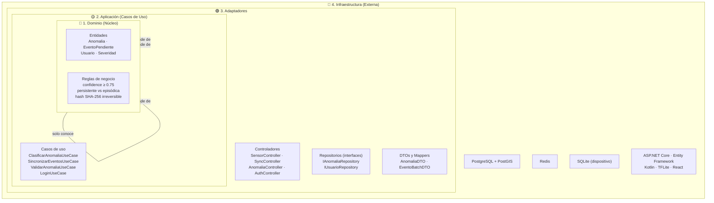
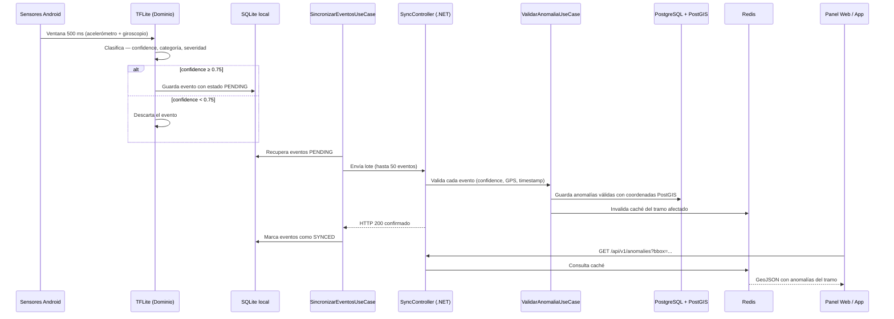

# Enfoque Arquitectónico — Clean Architecture

## ¿Qué es Clean Architecture?

Es un enfoque propuesto por Robert C. Martin ("Uncle Bob") que organiza el sistema alrededor de las **reglas de negocio**. Su principio fundamental es la **Regla de Dependencia**: las dependencias en el código fuente solo pueden apuntar hacia adentro, hacia el dominio. El núcleo del negocio jamás debe depender de la interfaz de usuario, la base de datos, los frameworks o los servicios externos.

> Si mañana cambiamos de PostgreSQL a MongoDB, o de ASP.NET a otro framework, el dominio de ViaLibre no cambia ni una sola línea.

---

## Las cuatro capas de ViaLibre

---

## Descripción de cada capa

### 1. Dominio — el núcleo del sistema

Es la capa más importante y la más protegida. Contiene las entidades del negocio y las reglas que definen cómo funciona ViaLibre, independientemente de cualquier tecnología.

No importa si el sistema corre en Android, en un servidor .NET o en la nube, las reglas del dominio son siempre las mismas.

**¿Qué contiene en ViaLibre?**

| Elemento | Descripción |
|---|---|
| `Anomalia` | Entidad principal. Contiene categoría, severidad (1–5), confidence (0.0–1.0), coordenadas GPS y timestamp. |
| `EventoPendiente` | Representa un evento detectado que aún no fue sincronizado con el servidor. |
| `Usuario` | Conductor no registrado, conductor registrado o administrador. |
| `Severidad` | Value Object que encapsula la escala 1–5 y sus reglas de validación. |
| Regla: confidence | Solo se registra un evento si `confidence ≥ 0.75`. Esta regla vive en el dominio, no en el controlador. |
| Regla: persistencia | Una anomalía es PERSISTENTE si aparece en `≥ 3 días distintos dentro de 15 días`. |
| Regla: privacidad | El identificador del dispositivo se hashea con SHA-256 irreversible antes de salir de la app. |

**Restricción absoluta:** el dominio no importa ningún framework, ninguna librería de base de datos, ni ningún SDK externo.

---

### 2. Aplicación — los casos de uso

Orquesta el flujo de datos entre el dominio y el mundo exterior. Cada caso de uso representa una acción concreta que el sistema puede realizar. No contiene reglas de negocio — las delega al dominio.

**Casos de uso de ViaLibre:**

| Caso de uso | ¿Qué hace? |
|---|---|
| `ClasificarAnomaliaUseCase` | Recibe la ventana de señal del sensor, invoca el modelo TFLite y decide si el evento supera el umbral de confidence para guardarse. |
| `SincronizarEventosUseCase` | Recupera los eventos con estado PENDING de SQLite y los envía al servidor en lotes de hasta 50, marcándolos SYNCED solo tras recibir HTTP 200. |
| `ValidarAnomaliaUseCase` | Aplica las reglas de calidad del servidor: confidence, precisión GPS y ventana de timestamp. |
| `ClasificarPersistenciaUseCase` | Determina si una anomalía es PERSISTENTE o EPISÓDICA según su frecuencia en los últimos 15 días. |
| `LoginUseCase` | Valida credenciales del administrador y emite un JWT con expiración de 8 horas. |
| `GestionUsuariosUseCase` | Permite al administrador crear, editar rol y desactivar usuarios, registrando cada acción en el log de auditoría. |

---

### 3. Adaptadores — la frontera con el exterior

Traducen los datos entre el formato que usa el dominio y el formato que usan los agentes externos (HTTP, base de datos, sensores). Ni el dominio ni los casos de uso saben que existen.

**¿Qué contiene en ViaLibre?**

| Elemento | Descripción |
|---|---|
| `SensorController` | Recibe las lecturas del acelerómetro y giroscopio desde el servicio Android e invoca `ClasificarAnomaliaUseCase`. |
| `SyncController` | Recibe el lote de eventos enviados por la app e invoca `SincronizarEventosUseCase`. |
| `AnomaliaController` | Expone el endpoint `GET /api/v1/anomalies?bbox=` que retorna anomalías en formato GeoJSON. |
| `AuthController` | Expone el endpoint de login y protege las rutas del panel con JWT. |
| `IAnomaliaRepository` | Interfaz que define cómo se guardan y consultan las anomalías. La implementación concreta vive en infraestructura. |
| `IUsuarioRepository` | Interfaz para la gestión de usuarios. |
| `AnomaliaDTO` | Objeto de transferencia que traduce la entidad `Anomalia` al formato JSON que consume el panel web. |
| `EventoBatchDTO` | Objeto que representa el lote de eventos enviados desde la app Android. |

---

### 4. Infraestructura — los detalles tecnológicos

Es la capa más externa. Contiene todo lo que puede cambiar sin afectar las reglas del negocio: la base de datos, el framework web, los SDKs externos y la configuración del servidor.

**¿Qué contiene en ViaLibre?**

| Elemento | Descripción |
|---|---|
| `AnomaliaRepositoryPostGIS` | Implementación concreta de `IAnomaliaRepository` usando PostgreSQL con PostGIS e índices GiST para consultas geoespaciales. |
| `UsuarioRepositoryEF` | Implementación de `IUsuarioRepository` usando Entity Framework Core. |
| `RedisCache` | Caché del mapa público. Invalida automáticamente cuando llega una nueva anomalía validada. |
| `SQLiteBuffer` | Buffer local en el dispositivo Android. Gestiona los estados PENDING y SYNCED de cada evento. |
| `TFLiteClassifier` | Carga el modelo `.tflite` embebido en el APK y ejecuta la inferencia sobre la ventana de 500 ms. |
| `ASP.NET Core` | Framework que inicializa el servidor, gestiona el pipeline HTTP y la inyección de dependencias. |
| `Docker Compose` | Orquesta el backend, PostgreSQL y Redis en Oracle Cloud ARM con un solo comando. |

---

## Flujo completo de un evento — de sensor a mapa

---

## Beneficios de Clean Architecture en ViaLibre

| Beneficio | Cómo se aplica |
|---|---|
| **Testeable** | Las reglas de negocio (confidence, persistencia, privacidad) se prueban sin base de datos ni sensores reales. |
| **Mantenible** | Un cambio en la lógica de clasificación no toca los controladores ni los repositorios. |
| **Evolutivo** | Cambiar de SQLite a Room, o de PostGIS a otro motor geoespacial, solo afecta la capa de infraestructura. |
| **Independiente de framework** | El dominio no importa ASP.NET ni Kotlin. Puede portarse a otro lenguaje si el proyecto lo requiere. |
| **Legible** | Cualquier desarrollador nuevo puede entender qué hace el sistema leyendo los casos de uso, sin necesidad de entender la infraestructura. |