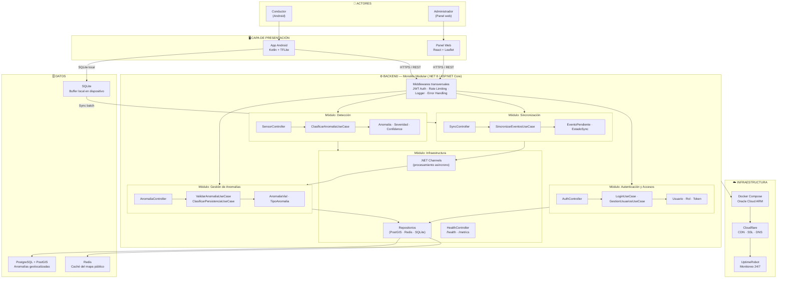

# Estilo Arquitectónico

## ¿Qué es un estilo arquitectónico?

Un estilo arquitectónico define la forma global en que se organiza y despliega un sistema. No describe qué hace el sistema, sino cómo está estructurado internamente y cómo se relacionan sus partes. Elegir el estilo correcto es una de las decisiones más importantes del arquitecto de software, porque condiciona todo lo que viene después: los módulos, las tecnologías, el despliegue y la capacidad de evolución.

---
## Estilo seleccionado: Monolito Modular con Arquitectura en Capas

KillaUru adopta el **Monolito Modular** como estilo arquitectónico global. Todo el backend corre en un único proceso ASP.NET Core (.NET 8), pero organizado internamente en módulos con responsabilidades claramente delimitadas. Cada módulo tiene sus propias capas internas siguiendo Clean Architecture, lo que permite extraerlo como servicio independiente en versiones futuras sin reescribir su lógica de negocio.

> **Capas = organización lógica interna. Monolito = unidad de despliegue.**

### ¿Por qué Monolito Modular?

| Razón | Explicación |
|---|---|
| **Un solo desarrollador** | No hay equipo que paralelice el trabajo en múltiples servicios. La complejidad operacional debe ser mínima. |
| **Plazo académico** | 6 a 8 semanas para tener el sistema en producción. Un monolito se despliega con un solo comando. |
| **Presupuesto cero** | Oracle Cloud ARM Free Tier tiene recursos limitados. Un solo proceso consume menos memoria que varios servicios corriendo en paralelo. |
| **Evolución ordenada** | Los módulos internos tienen interfaces claras desde el inicio. Cuando el sistema crezca, cada módulo puede convertirse en un servicio independiente sin tocar los demás. |

---

## Diagrama de arquitectura del sistema

---

## Reglas fundamentales de la arquitectura

Estas reglas no son sugerencias — son los límites que mantienen el sistema ordenado conforme crece:

**1. Invocación descendente por capas**
Cada capa solo invoca a la capa inmediatamente inferior. El controlador llama al caso de uso, el caso de uso llama al repositorio. Nunca al revés.

**2. Aislamiento entre módulos**
Un módulo no puede acceder directamente al repositorio o a las tablas de otro módulo. Si el módulo de Anomalías necesita datos de Autenticación, lo hace a través de la interfaz del servicio correspondiente, nunca tocando su base de datos directamente.

**3. Dominio sin dependencias externas**
Las entidades del dominio (Anomalia, EventoPendiente, Usuario) no conocen nada de ASP.NET, PostgreSQL ni ningún framework. Son clases puras de C# que pueden probarse sin levantar ningún servicio.

**4. Despliegue único**
Todo el backend corre en un único contenedor Docker conectado a una única base de datos PostgreSQL. No hay orquestación de múltiples servicios en v1.0.

**5. Evolución controlada**
Cuando el sistema crezca y un módulo necesite escalar de forma independiente, puede extraerse como servicio sin modificar los demás, porque sus interfaces ya están definidas desde el inicio.

---

## Stack tecnológico

| Componente | Tecnología | Justificación |
|---|---|---|
| App móvil | Kotlin + TFLite | Acceso directo a sensores a 50 Hz. TFLite para inferencia local < 50 ms. |
| Backend | ASP.NET Core .NET 8 | Tecnología principal del autor. Alto rendimiento, soporte nativo para async/await y .NET Channels. |
| Base de datos | PostgreSQL + PostGIS | Único motor open source con soporte geoespacial serio para producción. |
| Caché | Redis | Respuestas del mapa público en menos de 250 ms sin consultar PostgreSQL en cada petición. |
| Panel web | React + Leaflet | React para la interfaz administrativa. Leaflet para renderizar el mapa sobre OpenStreetMap. |
| Infraestructura | Docker Compose + Oracle Cloud ARM | Costo operativo cero. Un solo comando levanta todo el sistema. |
| CDN y SSL | Cloudflare Free | TLS 1.3, calificación A+ en SSL Labs, caché de assets estáticos sin costo. |
| Monitoreo | UptimeRobot Free | Alerta por correo ante caídas, monitoreo cada 5 minutos de los 4 subdominios. |