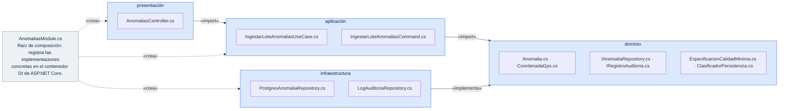
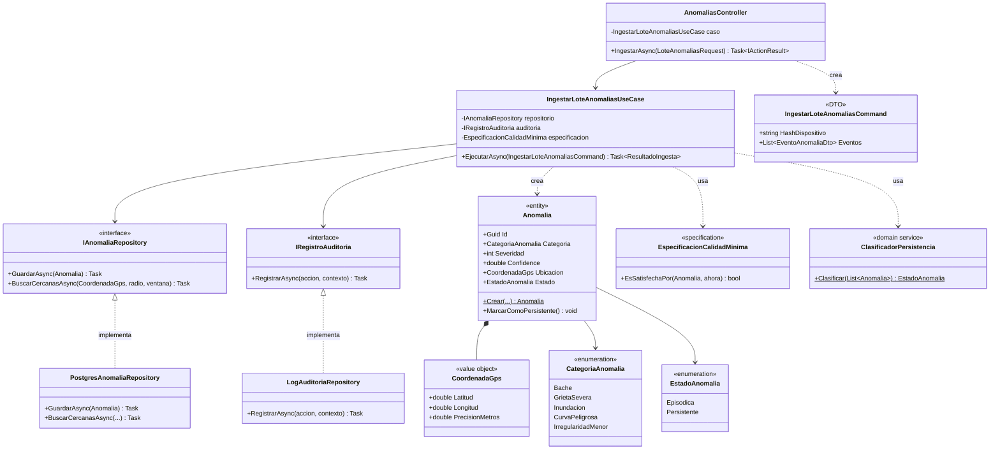
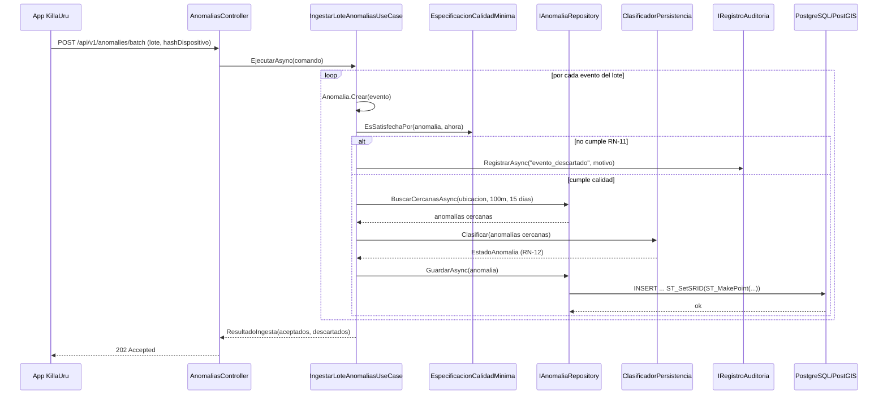

# Diseño interno de módulos

> **Proyecto:** KillaUru · **Backend:** ASP.NET Core 8 (C#) · **Módulo de referencia:** Ingesta de Anomalías
> **Enfoque arquitectónico:** Clean Architecture dentro de cada módulo del monolito modular
> **Nivel C4:** 4 – Código · **Versión:** 1.0

---

## 1. Propósito

Este documento describe **cómo se organiza el código dentro de un módulo** del backend de KillaUru. Tiene tres objetivos:

- que los nueve módulos de `componentes-arquitectonicos.md` se construyan con la misma estructura;
- que las reglas de negocio (RN-11, RN-12, etc.) queden aisladas de ASP.NET Core, Dapper y PostgreSQL;
- que, al ser un proyecto de una sola persona (DA-06), cualquier retoma del código años después siga un patrón reconocible.

Se usa **Ingesta de Anomalías** como módulo de referencia porque es el más complejo del backend: recibe el lote de la app, aplica la validación de calidad (RN-11), la confirmación por severidad y la clasificación persistente/episódica (RN-12), y persiste en PostGIS. Los demás módulos (Autenticación, Mapa, Usuarios y Roles, Auditoría, Dashboard, Exportación) siguen la misma estructura con menos capas de reglas.

## 2. Estructura de carpetas

```text
src/
└── Modules/
    └── Anomalias/
        ├── Dominio/
        │   ├── Anomalia.cs                      Entidad Anomalia y sus invariantes
        │   ├── CoordenadaGps.cs                  Objeto de valor CoordenadaGps
        │   ├── CategoriaAnomalia.cs              Enumeración CategoriaAnomalia
        │   ├── EstadoAnomalia.cs                 Enumeración EstadoAnomalia
        │   ├── ReglaNegocioException.cs          Excepción de dominio
        │   ├── IAnomaliaRepository.cs            Interfaz (puerto) de persistencia
        │   ├── IRegistroAuditoria.cs             Interfaz (puerto) de auditoría
        │   ├── EspecificacionCalidadMinima.cs     Regla RN-11 (Specification)
        │   └── ClasificadorPersistencia.cs       Servicio de dominio · regla RN-12
        ├── Aplicacion/
        │   ├── IngestarLoteAnomaliasUseCase.cs   Caso de uso IngestarLoteAnomalias
        │   └── IngestarLoteAnomaliasCommand.cs   Datos de entrada del caso de uso
        ├── Infraestructura/
        │   ├── PostgresAnomaliaRepository.cs     Implementación con PostgreSQL/PostGIS
        │   └── LogAuditoriaRepository.cs         Implementación append-only
        ├── Presentacion/
        │   └── AnomaliasController.cs            Traduce HTTP ⇄ caso de uso
        └── AnomaliasModule.cs                    Raíz de composición (registro DI)
```

| Archivo | Capa | Responsabilidad | Depende de |
|---|---|---|---|
| `Anomalia.cs` | Dominio | Crear anomalías válidas, guardar su estado | Solo dominio |
| `CoordenadaGps.cs` | Dominio | Representar lat/long/precisión como valor inmutable | Nada |
| `CategoriaAnomalia.cs` / `EstadoAnomalia.cs` | Dominio | Enumerar los valores posibles | Nada |
| `IAnomaliaRepository.cs` | Dominio | Declarar **qué** persistencia necesita el módulo | `Anomalia.cs` |
| `IRegistroAuditoria.cs` | Dominio | Declarar **qué** necesita el módulo para auditar | Nada |
| `EspecificacionCalidadMinima.cs` | Dominio | Evaluar RN-11 (confidence, precisión GPS, ventana de tiempo) | `Anomalia.cs` |
| `ClasificadorPersistencia.cs` | Dominio | Evaluar RN-12 sobre una lista de anomalías cercanas | `Anomalia.cs` |
| `IngestarLoteAnomaliasUseCase.cs` | Aplicación | Coordinar validación, confirmación, clasificación y guardado | Dominio |
| `IngestarLoteAnomaliasCommand.cs` | Aplicación | Datos de entrada validados del caso de uso | Nada |
| `PostgresAnomaliaRepository.cs` | Infraestructura | Guardar/consultar anomalías en PostGIS | Dominio + Dapper/Npgsql |
| `LogAuditoriaRepository.cs` | Infraestructura | Insertar en el log append-only | Dominio + Dapper/Npgsql |
| `AnomaliasController.cs` | Presentación | Recibir el lote HTTP, invocar el caso de uso y responder | Aplicación |
| `AnomaliasModule.cs` | Composición | Registrar las implementaciones concretas en el contenedor DI | Todas las capas |

---

## 3. Capas del módulo y regla de dependencia



**Regla de dependencia:** el código solo puede importar hacia el centro (dominio). El dominio no conoce `Microsoft.AspNetCore`, `Dapper` ni `Npgsql`.

| Capa | Contiene | Responsabilidad | Puede depender de | **No** puede depender de |
|---|---|---|---|---|
| **Dominio** | Entidades, objetos de valor, enumeraciones, interfaces (puertos), specifications, servicios de dominio | Reglas de negocio ciertas con cualquier tecnología | Nada externo | Aplicación, infraestructura, presentación, ASP.NET Core, Dapper |
| **Aplicación** | Casos de uso, comandos | Orquestar el flujo: validar → confirmar → clasificar → guardar | Dominio | Infraestructura, presentación, Dapper, Npgsql |
| **Infraestructura** | Repositorios concretos | Implementar las interfaces del dominio con PostgreSQL/PostGIS | Dominio, Dapper, Npgsql | Aplicación, presentación |
| **Presentación** | Controlador | Traducir HTTP a llamadas del caso de uso y viceversa | Aplicación | Infraestructura, base de datos |
| **Composición** | `AnomaliasModule.cs` | Registrar implementaciones concretas en el contenedor DI | Todas | — |

> **Cómo comprobarlo en el código:** basta revisar los `using` de `Dominio/`. Si aparece `Microsoft.AspNetCore.*`, `Dapper`, `Npgsql` o cualquier clase de `Infraestructura/`, la regla se rompió. A diferencia del ejemplo en Node.js, en .NET la raíz de composición no crea instancias manualmente: **registra** tipos en el contenedor de Inyección de Dependencias nativo de ASP.NET Core, que resuelve el grafo de objetos en cada petición.

---

## 4. Diagrama de clases



### 4.1 Notación UML utilizada

| Símbolo | Significado | Ejemplo en el diagrama |
|---|---|---|
| Línea continua con flecha | Asociación: la clase guarda una referencia a la otra | `IngestarLoteAnomaliasUseCase` → `IAnomaliaRepository` |
| Línea discontinua con flecha abierta | Dependencia: la usa o la crea, pero no la guarda | `AnomaliasController` «crea» `IngestarLoteAnomaliasCommand` |
| Línea discontinua con triángulo hueco | Realización: implementa una interfaz | `PostgresAnomaliaRepository` ▷ `IAnomaliaRepository` |
| Rombo relleno | Composición: la parte no existe sin el todo | `Anomalia` ◆ `CoordenadaGps` |
| «interface» / «specification» / «domain service» | Estereotipo de la clase | `IAnomaliaRepository`, `EspecificacionCalidadMinima` |
| `-` / `+` / `$` | Privado / público / estático | `-repositorio`, `+Crear()$` |

---

## 5. Flujo de ejecución: ingestar lote de anomalías



| Paso | Origen → destino | Acción | Capa |
|---|---|---|---|
| 1 | App → `AnomaliasController` | `POST /api/v1/anomalies/batch` con el lote y `hashDispositivo` | Presentación |
| 2 | `AnomaliasController` → `IngestarLoteAnomaliasUseCase` | `EjecutarAsync(cmd)` | Presentación → Aplicación |
| 3 | `UseCase` → `Anomalia` | `Crear(...)`: valida severidad, confidence y hash | Aplicación → Dominio |
| 4 | `UseCase` → `EspecificacionCalidadMinima` | `EsSatisfechaPor(...)` (RN-11) | Aplicación → Dominio |
| 5 | Si no cumple | `UseCase` → `IRegistroAuditoria` | `RegistrarAsync("evento_descartado", ...)` |
| 6 | Si cumple | `UseCase` → `IAnomaliaRepository` | `BuscarCercanasAsync(...)`: confirmación (severidad alta) y datos para RN-12 |
| 7 | `UseCase` → `ClasificadorPersistencia` | `Clasificar(...)` (RN-12) | Aplicación → Dominio |
| 8 | `UseCase` → `IAnomaliaRepository` | `GuardarAsync(anomalia)` | Aplicación → Dominio (interfaz) |
| 9 | `PostgresAnomaliaRepository` → PostGIS | `INSERT` con geometría (`ST_MakePoint`) | Infraestructura → BD |
| 10 | `AnomaliasController` → App | `202 Accepted` con `{ aceptados, descartados }` | Presentación |

---

## 6. Código de referencia

### 6.1 Dominio

```csharp
// Dominio/CoordenadaGps.cs
namespace KillaUru.Api.Modules.Anomalias.Dominio;

public sealed record CoordenadaGps(double Latitud, double Longitud, double PrecisionMetros)
{
    public static CoordenadaGps Crear(double latitud, double longitud, double precisionMetros)
    {
        if (precisionMetros < 0)
            throw new ReglaNegocioException("La precisión GPS no puede ser negativa.");
        return new CoordenadaGps(latitud, longitud, precisionMetros);
    }
}
```

```csharp
// Dominio/CategoriaAnomalia.cs
namespace KillaUru.Api.Modules.Anomalias.Dominio;

public enum CategoriaAnomalia
{
    Bache,
    GrietaSevera,
    Inundacion,
    CurvaPeligrosa,
    IrregularidadMenor,
}
```

```csharp
// Dominio/EstadoAnomalia.cs
namespace KillaUru.Api.Modules.Anomalias.Dominio;

public enum EstadoAnomalia
{
    Episodica,
    Persistente,
}
```

```csharp
// Dominio/ReglaNegocioException.cs
namespace KillaUru.Api.Modules.Anomalias.Dominio;

public sealed class ReglaNegocioException(string mensaje) : Exception(mensaje);
```

```csharp
// Dominio/Anomalia.cs
namespace KillaUru.Api.Modules.Anomalias.Dominio;

public sealed class Anomalia
{
    public Guid Id { get; }
    public CategoriaAnomalia Categoria { get; }
    public int Severidad { get; }
    public double Confidence { get; }
    public CoordenadaGps Ubicacion { get; }
    public DateTime TimestampUtc { get; }
    public string HashDispositivo { get; }
    public EstadoAnomalia Estado { get; private set; }

    private Anomalia(Guid id, CategoriaAnomalia categoria, int severidad, double confidence,
        CoordenadaGps ubicacion, DateTime timestampUtc, string hashDispositivo)
    {
        Id = id;
        Categoria = categoria;
        Severidad = severidad;
        Confidence = confidence;
        Ubicacion = ubicacion;
        TimestampUtc = timestampUtc;
        HashDispositivo = hashDispositivo;
        Estado = EstadoAnomalia.Episodica; // por defecto hasta que ClasificadorPersistencia diga lo contrario
    }

    public static Anomalia Crear(CategoriaAnomalia categoria, int severidad, double confidence,
        CoordenadaGps ubicacion, DateTime timestampUtc, string hashDispositivo)
    {
        if (severidad is < 1 or > 5)
            throw new ReglaNegocioException("La severidad debe estar entre 1 y 5.");
        if (confidence is < 0 or > 1)
            throw new ReglaNegocioException("El confidence debe estar entre 0.0 y 1.0.");
        if (string.IsNullOrWhiteSpace(hashDispositivo))
            throw new ReglaNegocioException("RN-04: todo evento debe llevar el hash del dispositivo, nunca su identidad real.");

        return new Anomalia(Guid.NewGuid(), categoria, severidad, confidence, ubicacion, timestampUtc, hashDispositivo);
    }

    public void MarcarComoPersistente() => Estado = EstadoAnomalia.Persistente; // RN-12
}
```

```csharp
// Dominio/IAnomaliaRepository.cs
namespace KillaUru.Api.Modules.Anomalias.Dominio;

public interface IAnomaliaRepository
{
    Task GuardarAsync(Anomalia anomalia, CancellationToken ct = default);

    /// Anomalías en un radio (metros) y ventana (días), usadas para la confirmación
    /// de severidad alta y la clasificación de persistencia (RN-11, RN-12).
    Task<IReadOnlyList<Anomalia>> BuscarCercanasAsync(
        CoordenadaGps centro, double radioMetros, int ventanaDias, CancellationToken ct = default);
}
```

```csharp
// Dominio/IRegistroAuditoria.cs
namespace KillaUru.Api.Modules.Anomalias.Dominio;

public interface IRegistroAuditoria
{
    Task RegistrarAsync(string accion, string contexto, CancellationToken ct = default);
}
```

```csharp
// Dominio/EspecificacionCalidadMinima.cs
namespace KillaUru.Api.Modules.Anomalias.Dominio;

/// Patrón Specification: encapsula la regla RN-11. Una nueva condición de calidad
/// futura se agrega como una nueva Specification, sin tocar esta clase (Open/Closed).
public sealed class EspecificacionCalidadMinima
{
    private const double ConfidenceMinimo = 0.75;
    private const double PrecisionMaximaMetros = 20;

    public bool EsSatisfechaPor(Anomalia anomalia, DateTime ahoraUtc)
    {
        var dentroDeVentana = anomalia.TimestampUtc >= ahoraUtc.AddHours(-24) && anomalia.TimestampUtc <= ahoraUtc;
        return anomalia.Confidence >= ConfidenceMinimo
            && anomalia.Ubicacion.PrecisionMetros < PrecisionMaximaMetros
            && dentroDeVentana;
    }
}
```

```csharp
// Dominio/ClasificadorPersistencia.cs
namespace KillaUru.Api.Modules.Anomalias.Dominio;

/// Servicio de dominio: aplica RN-12. No depende de infraestructura — recibe
/// las anomalías cercanas que el caso de uso ya consultó.
public static class ClasificadorPersistencia
{
    private const int DiasMinimosDistintos = 3;

    public static EstadoAnomalia Clasificar(IReadOnlyList<Anomalia> anomaliasEnVentana15Dias)
    {
        var diasDistintos = anomaliasEnVentana15Dias.Select(a => a.TimestampUtc.Date).Distinct().Count();
        return diasDistintos >= DiasMinimosDistintos ? EstadoAnomalia.Persistente : EstadoAnomalia.Episodica;
    }
}
```

### 6.2 Aplicación

```csharp
// Aplicacion/IngestarLoteAnomaliasCommand.cs
namespace KillaUru.Api.Modules.Anomalias.Aplicacion;

public sealed record EventoAnomaliaDto(
    string Categoria, int Severidad, double Confidence,
    double Latitud, double Longitud, double PrecisionMetros, DateTime TimestampUtc);

public sealed record IngestarLoteAnomaliasCommand(string HashDispositivo, IReadOnlyList<EventoAnomaliaDto> Eventos);
```

```csharp
// Aplicacion/IngestarLoteAnomaliasUseCase.cs
using KillaUru.Api.Modules.Anomalias.Dominio;

namespace KillaUru.Api.Modules.Anomalias.Aplicacion;

public sealed record ResultadoIngesta(int Aceptados, int Descartados);

public sealed class IngestarLoteAnomaliasUseCase(
    IAnomaliaRepository repositorio,         // interfaz, no PostgresAnomaliaRepository
    IRegistroAuditoria auditoria,            // interfaz, no LogAuditoriaRepository
    EspecificacionCalidadMinima especificacionCalidad,
    TimeProvider reloj)
{
    public async Task<ResultadoIngesta> EjecutarAsync(IngestarLoteAnomaliasCommand cmd, CancellationToken ct = default)
    {
        int aceptados = 0, descartados = 0;
        var ahora = reloj.GetUtcNow().UtcDateTime;

        foreach (var evento in cmd.Eventos)
        {
            var ubicacion = CoordenadaGps.Crear(evento.Latitud, evento.Longitud, evento.PrecisionMetros);
            var anomalia = Anomalia.Crear(
                Enum.Parse<CategoriaAnomalia>(evento.Categoria), evento.Severidad, evento.Confidence,
                ubicacion, evento.TimestampUtc, cmd.HashDispositivo);

            if (!especificacionCalidad.EsSatisfechaPor(anomalia, ahora))
            {
                await auditoria.RegistrarAsync("evento_descartado", $"RN-11 no satisfecha: {anomalia.Id}", ct);
                descartados++;
                continue;
            }

            var cercanas = await repositorio.BuscarCercanasAsync(ubicacion, radioMetros: 100, ventanaDias: 15, ct);

            var tieneSegundoDispositivo = cercanas.Any(a => a.HashDispositivo != anomalia.HashDispositivo);
            if (anomalia.Severidad >= 4 && !tieneSegundoDispositivo)
            {
                await auditoria.RegistrarAsync("evento_pendiente_confirmacion", $"Severidad alta sin 2.º dispositivo: {anomalia.Id}", ct);
                descartados++;
                continue;
            }

            if (ClasificadorPersistencia.Clasificar(cercanas) == EstadoAnomalia.Persistente)
                anomalia.MarcarComoPersistente();

            await repositorio.GuardarAsync(anomalia, ct);
            aceptados++;
        }

        return new ResultadoIngesta(aceptados, descartados);
    }
}
```

> El precio… digo, la categoría exacta de un evento ambiguo podría enriquecerse en el futuro contra un servicio externo de clima (para distinguir inundación real de falso positivo). Se omite aquí para mantener el ejemplo enfocado en RN-11 y RN-12.

### 6.3 Infraestructura

```csharp
// Infraestructura/PostgresAnomaliaRepository.cs
using Dapper;
using Npgsql;
using KillaUru.Api.Modules.Anomalias.Dominio;

namespace KillaUru.Api.Modules.Anomalias.Infraestructura;

public sealed class PostgresAnomaliaRepository(NpgsqlDataSource dataSource) : IAnomaliaRepository
{
    public async Task GuardarAsync(Anomalia anomalia, CancellationToken ct = default)
    {
        const string sql = """
            INSERT INTO anomalias (id, categoria, severidad, confidence, ubicacion, timestamp_utc, hash_dispositivo, estado)
            VALUES (@Id, @Categoria, @Severidad, @Confidence,
                    ST_SetSRID(ST_MakePoint(@Longitud, @Latitud), 4326), @TimestampUtc, @HashDispositivo, @Estado)
            """;

        await using var conexion = await dataSource.OpenConnectionAsync(ct);
        await conexion.ExecuteAsync(new CommandDefinition(sql, new
        {
            anomalia.Id,
            Categoria = anomalia.Categoria.ToString(),
            anomalia.Severidad,
            anomalia.Confidence,
            anomalia.Ubicacion.Latitud,
            anomalia.Ubicacion.Longitud,
            anomalia.TimestampUtc,
            anomalia.HashDispositivo,
            Estado = anomalia.Estado.ToString(),
        }, cancellationToken: ct));
    }

    public async Task<IReadOnlyList<Anomalia>> BuscarCercanasAsync(
        CoordenadaGps centro, double radioMetros, int ventanaDias, CancellationToken ct = default)
    {
        const string sql = """
            SELECT categoria, severidad, confidence,
                   ST_Y(ubicacion) AS latitud, ST_X(ubicacion) AS longitud,
                   timestamp_utc, hash_dispositivo
            FROM anomalias
            WHERE ST_DWithin(ubicacion::geography, ST_SetSRID(ST_MakePoint(@Longitud, @Latitud), 4326)::geography, @RadioMetros)
              AND timestamp_utc >= @Desde
            """; // índice GiST sobre `ubicacion` — RNF-01: consultas del mapa <250 ms

        await using var conexion = await dataSource.OpenConnectionAsync(ct);
        var filas = await conexion.QueryAsync(new CommandDefinition(sql, new
        {
            centro.Latitud,
            centro.Longitud,
            RadioMetros = radioMetros,
            Desde = DateTime.UtcNow.AddDays(-ventanaDias),
        }, cancellationToken: ct));

        return filas.Select(f => Anomalia.Crear(
            Enum.Parse<CategoriaAnomalia>((string)f.categoria), (int)f.severidad, (double)f.confidence,
            CoordenadaGps.Crear((double)f.latitud, (double)f.longitud, 0), (DateTime)f.timestamp_utc, (string)f.hash_dispositivo)
        ).ToList();
    }
}
```

```csharp
// Infraestructura/LogAuditoriaRepository.cs
using Dapper;
using Npgsql;
using KillaUru.Api.Modules.Anomalias.Dominio;

namespace KillaUru.Api.Modules.Anomalias.Infraestructura;

public sealed class LogAuditoriaRepository(NpgsqlDataSource dataSource) : IRegistroAuditoria
{
    public async Task RegistrarAsync(string accion, string contexto, CancellationToken ct = default)
    {
        const string sql = """
            INSERT INTO log_auditoria (timestamp_utc, actor, accion, contexto)
            VALUES (@TimestampUtc, 'sistema', @Accion, @Contexto)
            """; // RF-15: append-only, nunca se actualiza ni se borra

        await using var conexion = await dataSource.OpenConnectionAsync(ct);
        await conexion.ExecuteAsync(new CommandDefinition(sql,
            new { TimestampUtc = DateTime.UtcNow, Accion = accion, Contexto = contexto }, cancellationToken: ct));
    }
}
```

### 6.4 Presentación

```csharp
// Presentacion/AnomaliasController.cs
using Microsoft.AspNetCore.Mvc;
using KillaUru.Api.Modules.Anomalias.Aplicacion;

namespace KillaUru.Api.Modules.Anomalias.Presentacion;

[ApiController]
[Route("api/v1/anomalies")]
public sealed class AnomaliasController(IngestarLoteAnomaliasUseCase ingestarLote) : ControllerBase
{
    [HttpPost("batch")]
    public async Task<IActionResult> IngestarAsync([FromBody] LoteAnomaliasRequest req, CancellationToken ct)
    {
        var comando = new IngestarLoteAnomaliasCommand(req.HashDispositivo, req.Eventos);
        var resultado = await ingestarLote.EjecutarAsync(comando, ct);
        return Accepted(new { resultado.Aceptados, resultado.Descartados });
    }
}

public sealed record LoteAnomaliasRequest(string HashDispositivo, IReadOnlyList<EventoAnomaliaDto> Eventos);
```

### 6.5 Raíz de composición

```csharp
// AnomaliasModule.cs
using KillaUru.Api.Modules.Anomalias.Dominio;
using KillaUru.Api.Modules.Anomalias.Infraestructura;
using KillaUru.Api.Modules.Anomalias.Aplicacion;

namespace KillaUru.Api.Modules.Anomalias;

public static class AnomaliasModule
{
    public static IServiceCollection AddAnomaliasModule(this IServiceCollection services) => services
        .AddSingleton<EspecificacionCalidadMinima>()
        .AddSingleton(TimeProvider.System)
        .AddScoped<IAnomaliaRepository, PostgresAnomaliaRepository>()   // cambiar el repositorio = cambiar esta línea
        .AddScoped<IRegistroAuditoria, LogAuditoriaRepository>()
        .AddScoped<IngestarLoteAnomaliasUseCase>();
}
```

```csharp
// Program.cs (extracto)
builder.Services.AddAnomaliasModule();
```

---

## 7. Patrones de diseño aplicados

| Patrón | Dónde | Qué resuelve |
|---|---|---|
| **Repository** | `IAnomaliaRepository` / `PostgresAnomaliaRepository` | Aísla al dominio del motor de persistencia (PostgreSQL/PostGIS). |
| **Specification** | `EspecificacionCalidadMinima` | Encapsula la regla RN-11 como objeto evaluable y extensible sin modificar el caso de uso. |
| **Domain Service** | `ClasificadorPersistencia` | Regla RN-12 que no pertenece a una sola entidad y no requiere estado propio. |
| **Factory Method** | `Anomalia.Crear(...)` | Garantiza que una `Anomalia` nunca exista en un estado inválido. |
| **Value Object** | `CoordenadaGps` (record inmutable) | Agrupa lat/long/precisión como una unidad, sin identidad propia. |
| **Dependency Injection / Composition Root** | `AnomaliasModule.AddAnomaliasModule(...)` | Conecta interfaces con implementaciones concretas en un único lugar. |
| **Command** | `IngestarLoteAnomaliasCommand` | Transporta la intención del cliente hacia el caso de uso como datos inmutables. |

### SOLID en el módulo

| Principio | Cómo se cumple |
|---|---|
| **S**RP | Cada clase tiene una sola razón de cambio: `Anomalia` las invariantes de la entidad, `EspecificacionCalidadMinima` solo RN-11, `ClasificadorPersistencia` solo RN-12. |
| **O**CP | Una nueva regla de calidad se agrega como una nueva Specification, sin editar `EspecificacionCalidadMinima` ni el caso de uso. |
| **L**SP | Cualquier `IAnomaliaRepository` (PostgreSQL hoy, otro motor mañana) puede sustituirse sin romper `IngestarLoteAnomaliasUseCase`. |
| **I**SP | `IRegistroAuditoria` solo expone `RegistrarAsync`; no se obliga a implementar métodos de lectura que este módulo no necesita. |
| **D**IP | `IngestarLoteAnomaliasUseCase` depende de `IAnomaliaRepository` e `IRegistroAuditoria` (abstracciones), nunca de `PostgresAnomaliaRepository` ni de `LogAuditoriaRepository` directamente. |