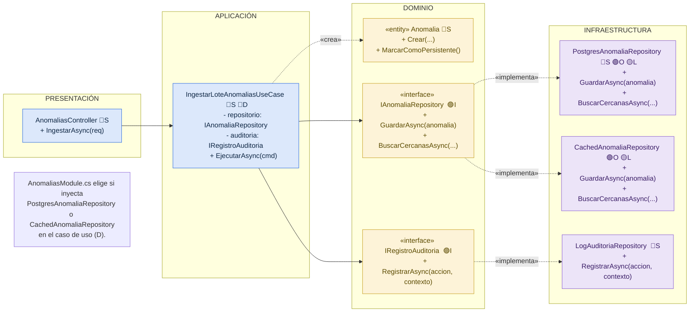

# Principios de diseño (SOLID)

## Objetivo

Documentar cómo se aplican los principios SOLID en el backend de KillaUru, organizado con Clean Architecture, para que las reglas de negocio (RN-11, RN-12, etc.) no dependan de ASP.NET Core, Dapper ni PostgreSQL.

## Contexto

- **Estilo:** monolito modular (ASP.NET Core 8 / C#).
- **Enfoque interno:** Clean Architecture (presentación, aplicación, dominio, infraestructura).
- **Módulo de referencia:** Ingesta de Anomalías, porque integra persistencia, caché y auditoría (ver `diseño-interno-de-modulos.md` y `patrones-de-diseño.md`).

## SOLID en el módulo Ingesta de Anomalías

🔵 **S** Responsabilidad única: una sola tarea por clase &nbsp;&nbsp; 🟢 **O** Abierto/cerrado: nueva necesidad = nueva clase
🟣 **I** Segregación: interfaces pequeñas por necesidad &nbsp;&nbsp; 🔴 **D** Inversión: el caso de uso depende de interfaces
🟡 **L** Liskov: Postgres y Cached son intercambiables

| Principio | Dónde se aplica (capa) | Cómo se cumple en KillaUru | Archivos |
|---|---|---|---|
| **S** · Responsabilidad única | Todas las capas | Cada clase tiene una sola tarea: el controlador traduce HTTP, el caso de uso coordina el flujo, la entidad aplica sus invariantes, la specification evalúa solo RN-11, el servicio de dominio evalúa solo RN-12, y el repositorio solo persiste | `AnomaliasController.cs`, `IngestarLoteAnomaliasUseCase.cs`, `Anomalia.cs`, `EspecificacionCalidadMinima.cs`, `ClasificadorPersistencia.cs`, `PostgresAnomaliaRepository.cs` |
| **O** · Abierto/cerrado | Infraestructura | Para agregar caché a las consultas del mapa se crea `CachedAnomaliaRepository` (patrón Decorator); `PostgresAnomaliaRepository` y el caso de uso no se modifican | `PostgresAnomaliaRepository.cs`, `CachedAnomaliaRepository.cs` |
| **L** · Sustitución de Liskov | Infraestructura | `PostgresAnomaliaRepository` y `CachedAnomaliaRepository` cumplen el mismo contrato `IAnomaliaRepository`; el caso de uso funciona igual sin saber cuál de los dos está inyectado | `PostgresAnomaliaRepository.cs`, `CachedAnomaliaRepository.cs` |
| **I** · Segregación de interfaces | Dominio | Cada interfaz tiene solo lo que Ingesta necesita: `IAnomaliaRepository` solo guarda y busca cercanas, `IRegistroAuditoria` solo registra | `IAnomaliaRepository.cs`, `IRegistroAuditoria.cs` |
| **D** · Inversión de dependencias | Aplicación | El caso de uso recibe interfaces por el constructor y no conoce Dapper, Npgsql ni PostgreSQL; las implementaciones se conectan en `AnomaliasModule.cs` | `IngestarLoteAnomaliasUseCase.cs`, `AnomaliasModule.cs` |

## Qué pasaría sin SOLID en KillaUru

| Situación real | Sin SOLID | Con SOLID |
|---|---|---|
| Se agrega caché a las consultas del mapa (RNF-01) | Hay que modificar el caso de uso de ingesta y de consulta | Solo se crea `CachedAnomaliaRepository` |
| Se necesita probar el caso de uso de ingesta | Se requiere una base de datos PostgreSQL real levantada | Se prueba con un `FakeAnomaliaRepository` en memoria |
| Cambia una regla de calidad (por ejemplo, el umbral de confidence de RN-11) | Hay que buscarla en el controlador, el repositorio o el caso de uso | Está solo en `EspecificacionCalidadMinima` |
| Se agrega una segunda fuente de validación (ventana GPS más estricta) | Se reescribe el método de validación existente, con riesgo de romper RN-11 | Se agrega una nueva Specification sin tocar la anterior |

## Relación con Clean Architecture y los patrones

| Principio | Lo cumple en el proyecto |
|---|---|
| Responsabilidad única | La separación en capas de Clean Architecture + Specification y Domain Service aislados (`diseño-interno-de-modulos.md`) |
| Abierto/cerrado y Liskov | El patrón Decorator aplicado a la caché del mapa y el patrón Repository (`patrones-de-diseño.md`) |
| Segregación de interfaces | Los puertos del dominio (`IAnomaliaRepository`, `IRegistroAuditoria`) |
| Inversión de dependencias | El patrón Repository y la raíz de composición `AnomaliasModule.cs`, con registro vía Inyección de Dependencias nativa de ASP.NET Core |